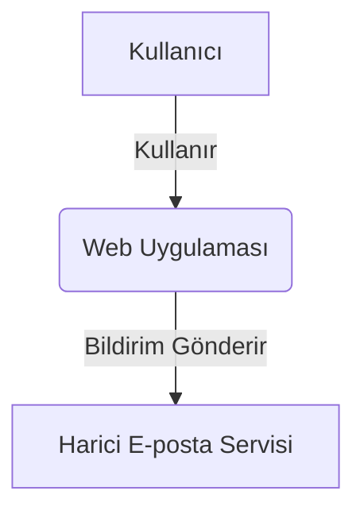
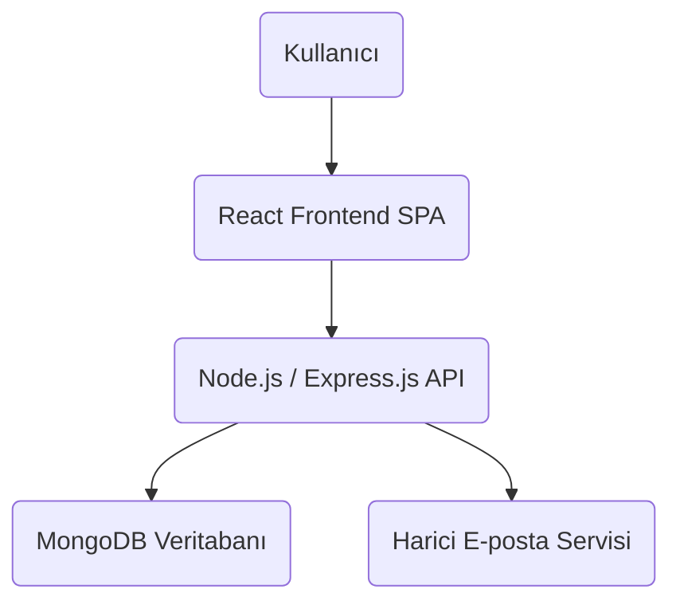

### 1.1. Genel Bakış

Proje, temel olarak "Kullanıcılar" tarafından kullanılan ve "Harici Sistemler" ile (örneğin e-posta hizmetleri) etkileşimde bulunan bir "Web Uygulaması"dır.



## 2. Konteyner Diyagramı (C4 Seviye 2: Container Diagram)

Konteyner diyagramı, Seviye 1'deki 'Web Uygulaması' kutusunun içine odaklanarak, sistemi oluşturan ana çalıştırılabilir birimleri (konteynerleri) ve aralarındaki etkileşimleri gösterir. Burada "konteyner" terimi, dağıtılabilir bir uygulamayı veya veri depolama alanını ifade eder.

### 2.1. Konteynerler ve Teknolojiler

*   **Frontend (React SPA):** Kullanıcı arayüzünü sunan ve etkileşimleri yöneten tek sayfalık bir React uygulamasıdır. Material-UI kütüphanesi ile modern ve responsive bir tasarım sunar.
*   **Backend (Node.js / Express.js API):** İş mantığını barındıran, veritabanı ile etkileşim kuran ve Frontend uygulamasına RESTful API hizmetleri sağlayan bir Node.js sunucusudur. Express.js çatısı kullanılarak geliştirilmiştir.
*   **MongoDB Veritabanı:** Projenin tüm kalıcı verilerini depolayan NoSQL veritabanıdır. Backend uygulaması tarafından Mongoose ODM aracılığıyla yönetilir.

### 2.2. Konteyner Etkileşimleri



## 3. Bileşen Diyagramları (C4 Seviye 3: Component Diagrams)

Bileşen diyagramları, Seviye 2'deki her bir konteynerin içine odaklanarak, onun içindeki ana kod bileşenlerini ve katmanları gösterir. Her bir bileşenin sorumlulukları ve akışları burada daha detaylı bir şekilde açıklanır.

### 3.1. Backend Konteyner Bileşenleri

Backend konteyneri, HTTP isteklerini işlemek, iş mantığını yürütmek ve veritabanı ile etkileşim kurmak üzere yapılandırılmıştır.

#### 3.1.1. Bileşenler ve Sorumluluklar

*   **API Router:** Gelen HTTP isteklerini uygun Controller'lara yönlendirir.
*   **Controller Katmanı:** İstemci isteklerini karşılar, isteği doğrular ve işlenmek üzere ilgili Service katmanına iletir. İşlem sonucunu istemciye standart bir HTTP yanıtı olarak formatlar.
*   **Service Katmanı:** Uygulamanın çekirdek iş mantığını (business logic) barındırır. Veritabanı işlemlerini Repository katmanı aracılığıyla yürütür ve karmaşık iş süreçlerini koordine eder.
*   **Repository Katmanı:** Veritabanı işlemlerini soyutlar. Mongoose ODM kullanarak MongoDB ile doğrudan etkileşim kurar, veri ekleme, okuma, güncelleme ve silme (CRUD) işlemlerini gerçekleştirir.
*   **Middleware:** Kimlik doğrulama (JWT), yetkilendirme, hata yönetimi, loglama, güvenlik (helmet) ve CORS gibi çapraz kesen konuları (cross-cutting concerns) yönetir.

#### 3.1.2. Backend Akışı

```mermaid
graph TD
    Client(Frontend) --> APIRouter[API Router]
    APIRouter --> Controller[Controller Katmanı]
    Controller --> Service[Service Katmanı (İş Mantığı)]
    Service --> Repository[Repository Katmanı (Veri Erişimi)]
    Repository --> MongoDB[(MongoDB Veritabanı)]
```


#### 3.2.2. Frontend Akışı ve Yapılandırma

```mermaid
graph TD
    User(Kullanıcı) --> MainApp[Ana Uygulama (App.js)]
    MainApp --> Router[React Router DOM]
    Router --> PageComponents[Sayfa/Rota Bileşenleri]
    PageComponents --> UIComponents[Ortak UI Bileşenleri]
    PageComponents --> APIServices[API Servisleri (axios)]
    APIServices --> Backend(Node.js / Express.js API)
    MainApp --> StateManagement[Durum Yönetimi (React Context / useState)]
    StateManagement --> AuthContext[Kimlik Doğrulama Bağlamı]
    AuthContext --> PageComponents
```


## 5. Sonuç

Projenin mimarisi, modüler, ölçeklenebilir ve sürdürülebilir bir yapı sunmaktadır. Belirlenen bu mimari özellikler, uygulamanın mevcut gereksinimlerini karşılarken, gelecekteki genişletmelere ve değişikliklere de olanak tanımaktadır.
