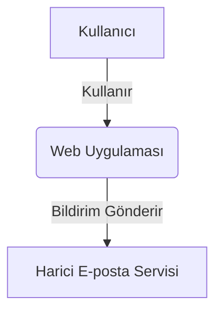
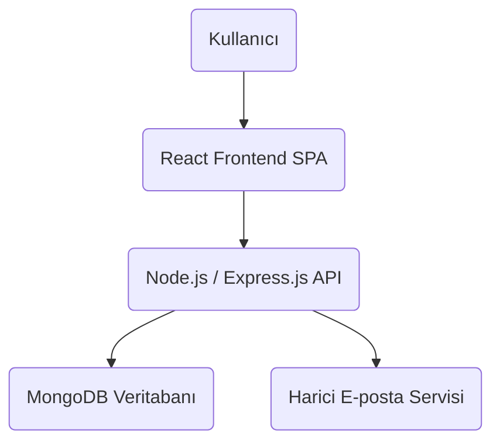

# Proje Mimarisi Dokümantasyonu - 24.11.2025


### 1.1. Genel Bakış

Proje, temel olarak "Kullanıcılar" tarafından kullanılan ve "Harici Sistemler" ile (örneğin e-posta hizmetleri) etkileşimde bulunan bir "Web Uygulaması"dır.



## 2. Konteyner Diyagramı (C4 Seviye 2: Container Diagram)


### 2.2. Konteyner Etkileşimleri



## 3. Bileşen Diyagramları (C4 Seviye 3: Component Diagrams)

Bileşen diyagramları, Seviye 2'deki her bir konteynerin içine odaklanarak, onun içindeki ana kod bileşenlerini ve katmanları gösterir. Her bir bileşenin sorumlulukları ve akışları burada daha detaylı bir şekilde açıklanır.


#### 3.1.2. Backend Katman Etkileşim Akışı

```mermaid
graph TD
    Client(Frontend) --> A[Giriş Noktası / Uygulama Kurulumu];
    A --> B[Middleware Katmanı];
    B --> C[API Yönlendirme & Controller Katmanı];
    C -- Basit İş Mantığı --> D{Veri Erişimi & Alan Mantığı Katmanı (Modeller)};
    C -- Karmaşık İş Mantığı --> E[Servis Katmanı];
    E --> D;
    E --> F[Ağ Geçidi Katmanı];
    D --> G[(MongoDB Veritabanı)];
    F --> H[Harici Servisler];

    subgraph Backend Uygulaması
        A
        B
        C
        D
        E
        F
    end
```

### 3.2. Frontend Konteyner Bileşenleri


#### 3.2.2. Frontend Akışı ve Yapılandırma

```mermaid
graph TD
    User(Kullanıcı) --> MainApp[Ana Uygulama (App.js)]
    MainApp --> Router[React Router DOM]
    Router --> PageComponents[Sayfa/Rota Bileşenleri]
    PageComponents --> UIComponents[Ortak UI Bileşenleri]
    PageComponents --> APIServices[API Servisleri (axios)]
    APIServices --> Backend(Node.js / Express.js API)
    MainApp --> StateManagement[Durum Yönetimi (React Context / useState)]
    StateManagement --> AuthContext[Kimlik Doğrulama Bağlamı]
    AuthContext --> PageComponents
```


