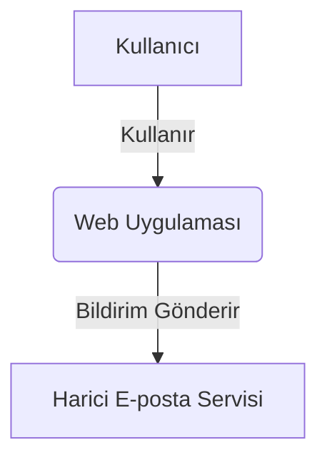
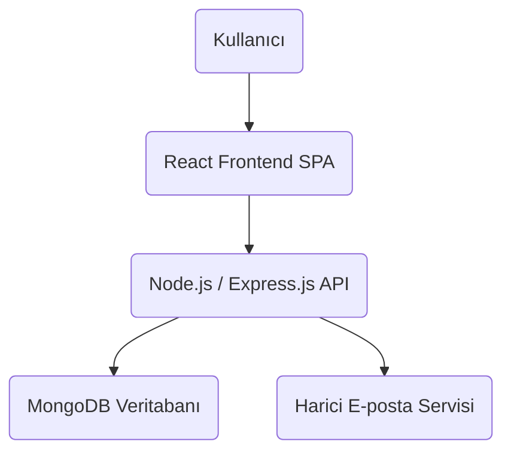

# Proje Mimarisi Dokümantasyonu - 24.11.2025


### 1.1. Genel Bakış

 etkileşimde bulunan bir "Web Uygulaması"dır.



## 2. Konteyner Diyagramı (C4 Seviye 2: Container Diagram)


### 2.2. Konteyner Etkileşimleri



## 3. Bileşen Diyagramları (C4 Seviye 3: Component Diagrams)


#### 3.1.2. Backend Katman Etkileşim Akışı

```mermaid
graph TD
    subgraph Backend Uygulaması
        A[Giriş Noktası / Uygulama Kurulumu]
        B[Middleware Katmanı]
        C[API Yönlendirme & Controller Katmanı]
        D{Veri Erişimi & Alan Mantığı Katmanı (Modeller)}
        E[Servis Katmanı]
        F[Ağ Geçidi Katmanı]
    end

    Client(Frontend) --> A
    A --> B
    B --> C
    C -- Basit İş Mantığı --> D
    C -- Karmaşık İş Mantığı --> E
    E --> D
    E --> F
    D --> G[(MongoDB Veritabanı)]
    F --> H[Harici Servisler]
```

### 3.2. Frontend Konteyner Bileşenleri


#### 3.2.2. Frontend Akışı ve Yapılandırma

```mermaid
graph TD
    subgraph Frontend Uygulaması
        MA[Ana Uygulama (App.js)]
        RT[React Router DOM]
        PC[Sayfa/Rota Bileşenleri]
        UI[Ortak UI Bileşenleri]
        AS[API Servisleri (axios)]
        SM[Durum Yönetimi (React Context / useState)]
        AC[Kimlik Doğrulama Bağlamı]
    end

    User(Kullanıcı) --> MA
    MA --> RT
    RT --> PC
    PC --> UI
    PC --> AS
    AS --> Backend(Node.js / Express.js API)
    MA --> SM
    SM --> AC
    AC --> PC
```

## 4. Genel Mimari Özellikleri ve Teknolojiler

### 4.1. Genel Yaklaşım

