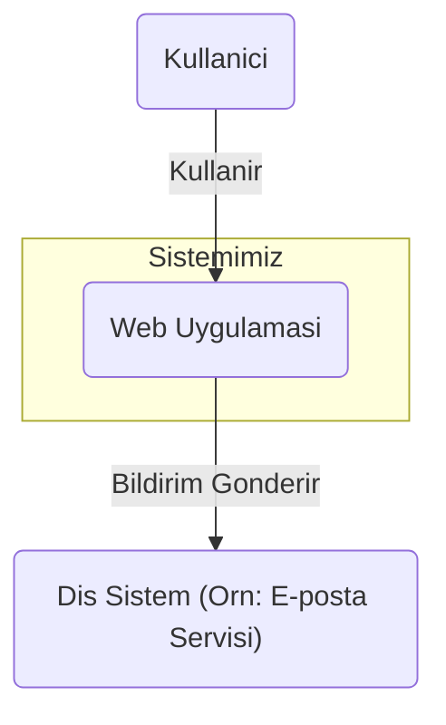
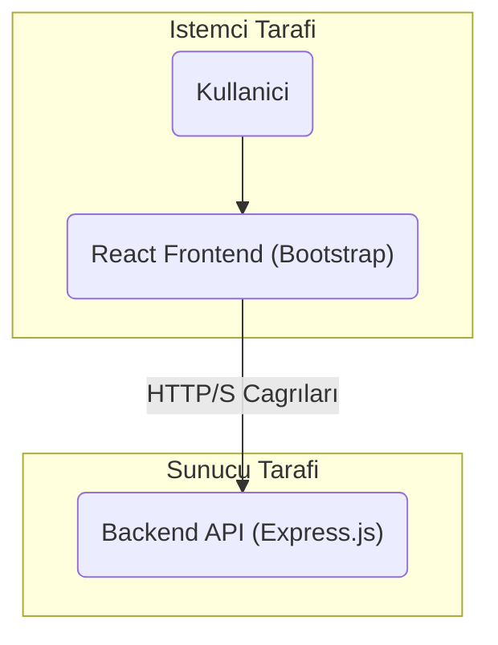
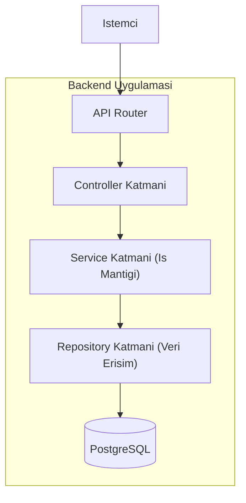
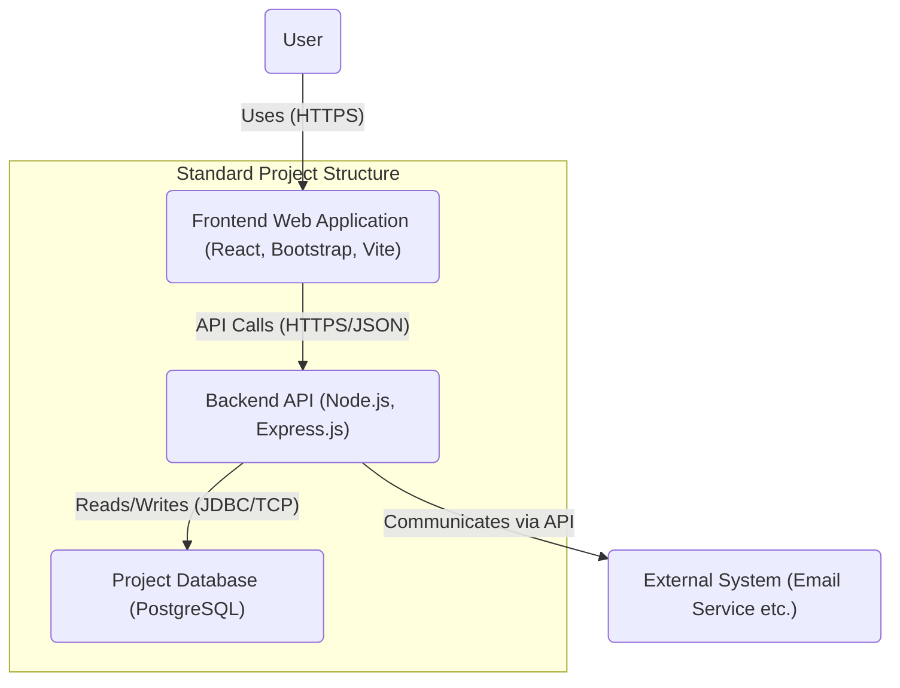
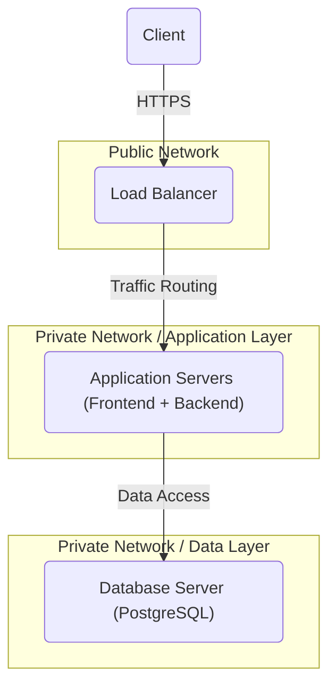

# Proje Mimarisi ve Geliştirme Raporu - 21.11.2025

## 1. Proje Özeti

Bu rapor, mevcut web uygulamasının teknik yapısı, kullanılan teknolojiler ve genel yetenekleri hakkında bilgi sunmaktadır. Proje, güvenli bir kullanıcı kayıt ve giriş altyapısı sunan modern bir web uygulamasıdır. Proje kök dizininde mimari, isimlendirme standartları ve gereksinimler gibi konularda oldukça detaylı dokümantasyon dosyaları bulunmaktadır. Bu durum, projenin planlı ve düzenli bir şekilde geliştirildiğini göstermektedir.

## 2. Teknik Yapı

Uygulama, birbirinden bağımsız olarak geliştirilebilen ve ölçeklendirilebilen **Backend** (sunucu tarafı) ve **Frontend** (istemci tarafı) olmak üzere iki ana bileşenden oluşmaktadır.

### 2.1. Backend Mimarisi

*   **Teknoloji:** Sunucu tarafı, Node.js çalışma zamanı ortamı ve Express.js web çatısı kullanılarak geliştirilmiştir.
*   **Mimari Yaklaşım:** Sürdürülebilir ve bakımı kolay, katmanlı ((Layered Architecture)) bir mimari benimsenmiştir. 

      **API Katmanı:** Dış dünyadan gelen HTTP isteklerinin ilk temas noktasıdır
      **Controller Katmanı:**İstemci isteklerini karşılayarak, isteği işlenmek üzere ilgili iş mantığı katmanına iletir. İşlem sonucunu istemciye standart bir HTTP yanıtı olarak formatlar.
      **Service Katmanı:**Uygulamanın çekirdek iş mantığını barındırır.
       **Repository Katmanı:** Veritabanı işlemleri, esneklik sağlayan **Repository Tasarım Deseni** ile yönetilmektedir. iş mantığı katmanının farklı veritabanı sistemleriyle (örneğin, PostgreSQL veya MongoDB) minimum değişiklikle çalışabilmesine olanak tanır ve kodun esnekliğini artırır Son geliştirmeler ile MongoDB desteği kaldırılmıştır.  Mevcut durumda yalnızca **PostgreSQL** veritabanı kullanılmaktadır.
      
      Bağımlılık yönetimi, kodun modülerliğini artıran bir DI (Dependency Injection) container'ı ile sağlanmaktadır. Bu, bileşenler arasındaki sıkı bağımlılığı (tight coupling) azaltır.
      
     
      
*   **Kod Kalitesi ve Araçlar:** Kod kalitesini sağlamak için ESLint, test süreçleri için Jest ve geliştirme ortamında verimliliği artırmak için Nodemon gibi endüstri standardı araçlar kullanılmaktadır.

### 2.2. Frontend Mimarisi
Frontend uygulaması, modern bir kullanıcı arayüzü oluşturmak için Vite üzerinde çalışan bir React uygulamasıdır.

*   **Teknoloji:** İstemci tarafı, popüler JavaScript kütüphanesi olan React ile geliştirilmiştir. Projenin derlenmesi ve geliştirme sunucusu için hızlı bir deneyim sunan Vite aracı tercih edilmiştir.
*   **Mimari Yaklaşım:** Kullanıcı arayüzü, yeniden kullanılabilir bileşenlerden (components) oluşmaktadır. Kullanıcı oturum yönetimi gibi global durumlar React Context API ile yönetilmekte, yetkilendirme kontrolleri ise korumalı rotalar (Protected Routes) aracılığıyla güvenli bir şekilde yapılmaktadır.
*   **Stil ve Arayüz:** Proje genelinde standart bir görünüm sağlamak amacıyla arayüz geliştirme kütüphanesi olarak **Bootstrap** kullanılmaktadır.

## 3. Yapılan Son İyileştirme Çalışmaları

Projenin bakımını kolaylaştırmak ve teknoloji yığınını sadeleştirmek amacıyla aşağıdaki önemli değişiklikler yapılmıştır:

1.  **Veritabanı Desteğinin Sadeleştirilmesi:** Daha önce mevcut olan MongoDB desteği kaldırılmıştır. Proje artık yalnızca PostgreSQL veritabanını desteklemektedir.
2.  **Arayüz Kütüphanesinin Standartlaştırılması:** Frontend tarafında standartlaşmayı sağlamak ve bakım maliyetini düşürmek amacıyla Material-UI (MUI) kütüphanesi kaldırılmış ve arayüz tamamen Bootstrap kullanılarak yeniden yapılandırılmıştır.

## 4. Genel Değerlendirme ve Sonuç

Mevcut durum itibarıyla proje, temel hedeflerini başarıyla karşılayan fonksiyonel bir yapıya sahiptir. Uygulama, aşağıdaki temel yetenekleri sunmaktadır:

*   **Güvenli Kullanım:** Uygulama, kullanıcı verilerinin korunmasına yönelik temel güvenlik prensipleriyle tasarlanmıştır.
*   **Modern ve Esnek Mimari:** Hem backend hem de frontend tarafında benimsenen katmanlı ve bileşen tabanlı mimariler, projenin gelecekte yeni özelliklerle genişletilmesini kolaylaştırmaktadır.
*   **Standartlaştırılmış Arayüz:** Bootstrap kullanımı, tüm platformlarda tutarlı ve responsive (cihaz uyumlu) bir kullanıcı deneyimi sağlamaktadır.

Sonuç olarak, proje sağlam bir temel üzerine inşa edilmiş olup, yeni fonksiyonellikler eklenmesi için hazır durumdadır. Mevcut yapı, projenin kararlı, güvenli ve sürdürülebilir bir şekilde geliştirilmesine olanak tanımaktadır.

## 5. Mimari Şemalar (Mermaid)

Aşağıdaki diyagramlar, C4 Model yaklaşımına göre hazırlanmış olup, sistem mimarisini farklı detay seviyelerinde sunmaktadır. Bu metin tabanlı diyagramlar, bilinen tüm platformlarla (GitHub, GitLab) uyumlu, en basit Mermaid sözdizimi kullanılarak oluşturulmuştur.

### 5.1. Sistem Bağlam Diyagramı (C4 Seviye 1: System Context Diagram)
Bu diyagram, sistemin (Web Uygulaması) dış dünya ile olan ilişkisini, kullanıcılarını ve etkileşimde bulunduğu diğer sistemleri en üst seviyeden gösterir. Sistem burada tek bir birim olarak ele alınır.

### 5.2. Konteyner Diyagramı (C4 Seviye 2: Container Diagram)
Bu diyagram, Seviye 1'deki 'Web Uygulaması' kutusunun içine zoom yaparak, sistemi oluşturan ana çalıştırılabilir birimleri (konteynerleri) ve aralarındaki etkileşimleri gösterir.

### 5.3. Bileşen Diyagramı (C4 Seviye 3: Component Diagram)
Bu diyagram, Seviye 2'deki 'Backend API' konteynerinin içine zoom yaparak, onun içindeki ana kod bileşenlerini ve katmanları gösterir. Her bir bileşenin sorumlulukları ve akışları burada detaylandırılır.

## 6. Referans Mimari Modelleri (Reference Architecture Models)

Bu bölümde, kurumsal referans mimari kılavuzumuzda tanımlanan ve standart bir proje yapısını temsil eden modeller sunulmaktadır.

### 6.1. Referans Konteyner Modeli (Reference Container Model)
Bu model, bir projenin temel yazılım birimlerinin (çalıştırılabilir uygulamalar, veritabanları gibi) nasıl bir araya gelmesi gerektiğini ve aralarındaki etkileşimleri göstermektedir.

### 6.2. Referans Dağıtım Modeli (Reference Deployment Model)
Bu model, bir projenin herhangi bir bulut veya yerel altyapı üzerinde standart olarak nasıl dağıtılması gerektiğini ve ana altyapı bileşenlerinin konumlandırılmasını göstermektedir.

