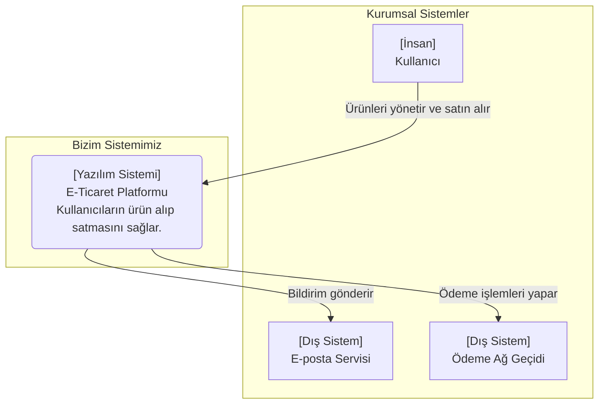
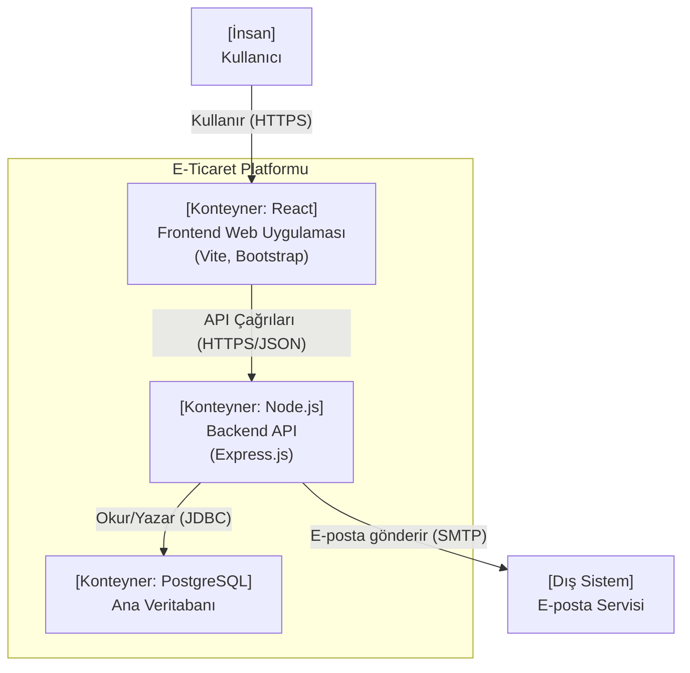
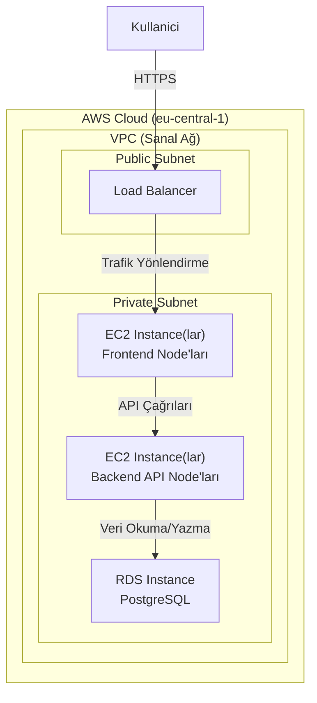
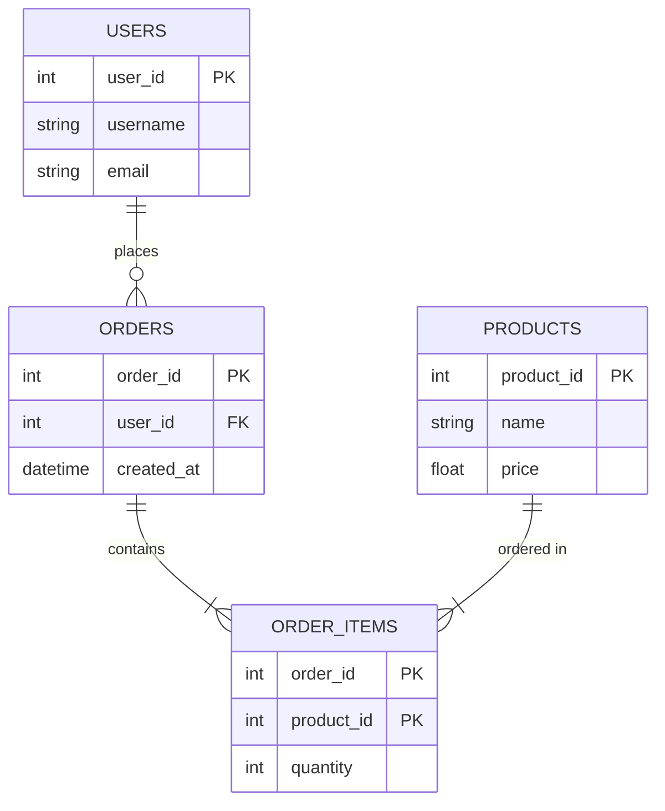

# Proje Adı - Mimari Dokümanı

**Sürüm:** 1.0
**Tarih:** DD.MM.YYYY
**Yazarlar:** [Yazar Adları]
**Durum:** [Taslak | İncelemede | Onaylandı]

---

## 1. Giriş

### 1.1. Amaç
Bu dokümanın temel amacı, **[Proje Adı]** sisteminin mimarisini, tasarım prensiplerini ve temel bileşenlerini açıklamaktır. Proje paydaşları için ortak bir anlayış oluşturmayı hedefler.

### 1.2. Kapsam
Bu doküman, sistemin [Örn: Kullanıcı Yönetimi, Sipariş Modülü vb.] bileşenlerini ve bu bileşenlerin birbirleriyle ve dış sistemlerle olan etkileşimlerini kapsamaktadır.

### 1.3. Hedef Kitle
Bu dokümanın hedef kitlesi proje yöneticileri, yazılım geliştiriciler, sistem mimarları ve kalite güvence uzmanlarıdır.

### 1.4. Referanslar
*   [Proje Gereksinim Dokümanı](link)
*   [API Spesifikasyonları](link)

---

## 2. Mimari Hedefler ve Kısıtlar

### 2.1. İş Hedefleri
*   [Örn: Pazara 3 ay içinde yeni bir ürünle çıkmak.]
*   [Örn: Operasyonel maliyetleri %20 azaltmak.]

### 2.2. Kalite Nitelikleri (Architectural Drivers)
Aşağıdaki kalite nitelikleri mimari kararlar için öncelikli yol göstericiler olmuştur:

*   **Performans:** Sistem, saniyede 1000 isteği 200ms altında yanıt süresi ile karşılamalıdır.
*   **Ölçeklenebilirlik:** Kullanıcı sayısı arttığında sistem yatay olarak (yeni sunucular eklenerek) ölçeklenebilmelidir.
*   **Güvenlik:** Tüm kullanıcı verileri şifrelenmeli ve yetkisiz erişime karşı korunmalıdır (OWASP Top 10 prensipleri).
*   **Sürdürülebilirlik (Maintainability):** Yeni bir geliştiricinin sisteme adapte olma süresi 2 haftayı geçmemelidir. Kod modüler ve iyi belgelenmiş olmalıdır.
*   **Kullanılabilirlik (Availability):** Sistemin çalışma zamanı oranı (uptime) %99.9 olmalıdır.

### 2.3. Teknik Kısıtlar
*   Tüm altyapı AWS bulut platformu üzerinde çalışmalıdır.
*   Proje bütçesi X TL'yi aşmamalıdır.
*   Mevcut `X` veritabanı ile entegrasyon zorunludur.

---

## 3. Sistem Genel Bakışı ve Bağlamı

### Diagram 1: Sistem Bağlam Diyagramı (C4 Model - Seviye 1)
Bu diyagram, sistemin kullanıcılar ve diğer dış sistemlerle olan temel etkileşimini gösterir.

---

## 4. Mantıksal ve Fiziksel Mimari

### 4.1. Konteyner Diyagramı (C4 Model - Seviye 2)
Bu diyagram, sistemin ana "konteynerlerini" (çalıştırılabilir uygulamalar, veritabanları, dosya sistemleri vb.) ve aralarındaki teknoloji odaklı iletişimi gösterir.

### 4.2. Dağıtım (Deployment) Mimarisi
Bu diyagram, sistemin hangi altyapı üzerinde nasıl çalışacağını gösterir.

---

## 5. Veri Mimarisi

### 5.1. Veri Modeli (Entity-Relationship Diagram)
Bu diyagram, sistemdeki ana veri varlıkları ve aralarındaki ilişkileri gösterir.

---

## 6. Teknik Yığın (Technology Stack)

| Kategori      | Teknoloji           | Gerekçe                                          |
|---------------|---------------------|--------------------------------------------------|
| Frontend      | React, Vite         | Hızlı geliştirme, zengin ekosistem.              |
| Stil          | Bootstrap           | Hızlı ve tutarlı arayüz geliştirme.              |
| Backend       | Node.js, Express.js | Yüksek performanslı I/O, JavaScript ekosistemi.  |
| Veritabanı    | PostgreSQL          | İlişkisel veri bütünlüğü, güvenilirlik.          |
| Altyapı       | AWS (EC2, RDS)      | Ölçeklenebilirlik, yönetilen servisler.          |
| CI/CD         | GitHub Actions      | Kolay entegrasyon, otomasyon.                    |

---

## 7. Mimari Karar Kayıtları (Architecture Decision Records - ADR)

Bu bölümde önemli mimari kararlar ve gerekçeleri listelenir.

*   **ADR-001: Veritabanı Seçimi**
    *   **Karar:** PostgreSQL, MongoDB yerine ana veritabanı olarak seçilmiştir.
    *   **Gerekçe:** Proje verilerinin ilişkisel doğası ve ACID uyumluluğu gereksinimi nedeniyle.

*   **ADR-002: Arayüz Kütüphanesi**
    *   **Karar:** Material-UI yerine Bootstrap standart arayüz kütüphanesi olarak belirlenmiştir.
    *   **Gerekçe:** Takımın mevcut yetkinliği ve daha hızlı prototipleme imkanı.

---
