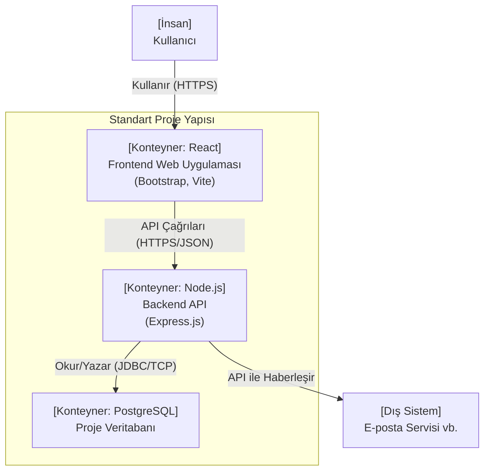
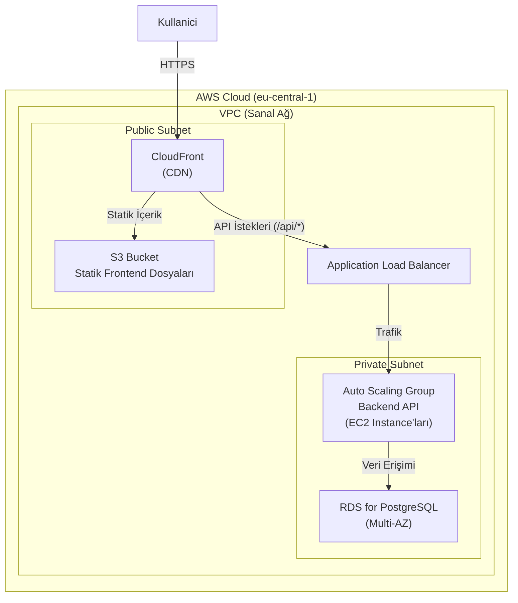

# Kurumsal Web Uygulamaları - Referans Mimarisi Kılavuzu

**Sürüm:** 1.0
**Tarih:** 24.11.2025
**Sorumlu Ekip:** Mimari Komitesi

---

## 1. Giriş

### 1.1. Amaç
Bu dokümanın amacı, kurum içinde geliştirilecek yeni nesil web uygulamaları için standartlaştırılmış, yeniden kullanılabilir bir **referans mimarisi** tanımlamaktır. Bu kılavuz, projelerin tutarlı, güvenli, ölçeklenebilir ve sürdürülebilir bir temel üzerinde hızla geliştirilmesini sağlamayı hedefler.

### 1.2. Kapsam
Bu referans mimari, REST API tabanlı bir backend ve modern bir frontend'e sahip olan tüm yeni web uygulamaları için geçerlidir. Mobil uygulamalar veya özel masaüstü çözümleri bu dokümanın kapsamı dışındadır.

### 1.3. Hedef Kitle
Bu doküman, yeni bir projeye başlayacak olan tüm yazılım geliştiriciler, teknik liderler, ürün yöneticileri ve mimarlar için bir başlangıç noktası ve kılavuz niteliğindedir.

---

## 2. Mimari Prensipler ve Kalite Hedefleri

Bu referans mimariyi temel alan tüm projeler aşağıdaki prensiplere uymalıdır:

*   **Katmanlı Mimari (Layered Architecture):** Sunum, iş mantığı ve veri erişim katmanları birbirinden net bir şekilde ayrılmalıdır.
*   **Bağımlılıkların Dışa Aktarılması (Dependency Injection):** Bileşenler arasındaki bağımlılıklar, test edilebilirliği ve modülerliği artırmak için DI konteyneri aracılığıyla yönetilmelidir.
*   **API Odaklı Yaklaşım (API-First):** Frontend ve backend arasındaki iletişim, iyi tanımlanmış ve standartlaştırılmış API kontratları üzerinden yapılmalıdır.
*   **Güvenlik Varsayılanı (Secure by Default):** Tüm projeler, temel güvenlik standartlarını (veri şifreleme, yetkilendirme, girdi doğrulama) varsayılan olarak uygulamalıdır.
*   **Otomasyon:** Test, derleme ve dağıtım süreçleri CI/CD ile tamamen otomatikleştirilmelidir.

---

## 3. Standart Teknik Yığın (Standard Technology Stack)

Yeni projelerde, aşağıda listelenen onaylanmış teknoloji yığınının kullanılması **zorunludur**. Bu standartlardan sapmalar, mimari komitesinin onayını gerektirir.

| Kategori      | Teknoloji           | Gerekçe                                                 |
|---------------|---------------------|---------------------------------------------------------|
| Frontend      | React, Vite         | Geniş ekosistem, yüksek performanslı geliştirme deneyimi. |
| Stil          | Bootstrap 5         | Tutarlı arayüzler ve hızlı prototipleme.                |
| Backend       | Node.js, Express.js | Yüksek I/O performansı, tam yığın JavaScript yetkinliği.  |
| Veritabanı    | PostgreSQL          | Güvenilirlik, ilişkisel veri bütünlüğü ve geniş özellik seti. |
| Konteynerleme | Docker              | Ortam tutarlılığı ve taşınabilirlik.                      |
| Altyapı       | AWS (EC2, RDS, S3)  | Ölçeklenebilirlik ve yönetilen servislerin verimliliği.   |
| CI/CD         | GitHub Actions      | Kaynak kod ile entegrasyon kolaylığı.                   |

---

## 4. Referans Mimari Modelleri

Aşağıdaki diyagramlar, bu kılavuza uygun bir projenin ideal yapısını göstermektedir.

### 4.1. Referans Konteyner Modeli
Bu model, bir projenin temel bileşenlerinin (konteynerler) nasıl yapılandırılması gerektiğini gösterir.

### 4.2. Referans Dağıtım Modeli (AWS için)
Bu model, bir projenin standart olarak AWS üzerinde nasıl dağıtılması gerektiğini gösterir.

---

## 5. Mimari Karar Kayıtları (ADRs)

Bu referans mimarinin temelini oluşturan kararlar.

*   **ADR-001: Standart Veritabanı Olarak PostgreSQL'in Seçilmesi**
    *   **Karar:** Tüm projeler için varsayılan ilişkisel veritabanı PostgreSQL olacaktır.
    *   **Gerekçe:** Açık kaynak olması, kanıtlanmış güvenilirliği, zengin özellik seti (JSONB desteği vb.) ve bulut sağlayıcıları tarafından geniş çapta desteklenmesi. Projelerin büyük çoğunluğunun ilişkisel veri modeline ihtiyaç duyması.

*   **ADR-002: Backend Dili Olarak Node.js'in Seçilmesi**
    *   **Karar:** Backend servisleri için standart dil ve platform Node.js olacaktır.
    *   **Gerekçe:** Frontend'de de JavaScript (React) kullanılması sayesinde "tam yığın JavaScript" yetkinliği oluşturarak ekip içi esnekliği artırmak. Asenkron ve non-blocking yapısı sayesinde yüksek I/O'lu uygulamalarda performans avantajı.

---

## 6. Yeni Bir Proje Başlatma

Bu referans mimariye uygun yeni bir proje başlatmak için aşağıdaki adımlar izlenmelidir:

1.  **Template Repositories:** Kurumun GitHub'ında bulunan `template-frontend` ve `template-backend` repolarını klonlayın. Bu repolar, standart dosya yapısını, CI/CD pipeline'larını ve temel konfigürasyonları içerir.
2.  **Mimari İnceleme:** Projenin başlangıcında, bu referans mimariden herhangi bir sapma olup olmayacağını belirlemek için mimari komitesi ile kısa bir toplantı düzenleyin.
3.  **Geliştirme:** Dokümanda belirtilen standart teknoloji yığınını ve prensipleri takip ederek geliştirmeyi sürdürün.
