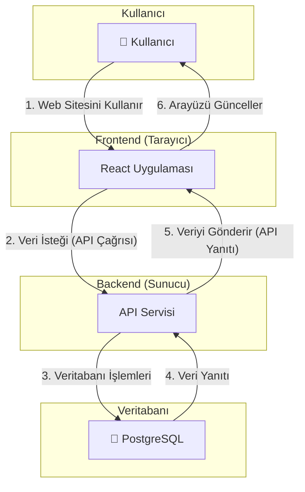
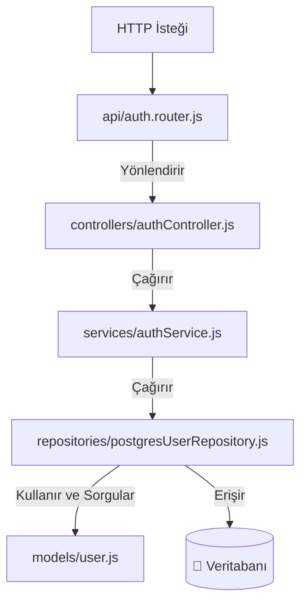

# Proje Mimarisi Raporu

**Tarih:** 23 Kasım 2025
**Konu:** Projenin Genel Teknik Yapısı ve Mimarisi Hakkında Bilgilendirme

---

## Yönetici Özeti

Bu rapor, mevcut projenin mimari temelini ve teknolojik altyapısını özetlemektedir. Proje, modern, güvenli ve ölçeklenebilir bir web uygulaması olarak tasarlanmıştır. Mimarisi, birbirinden bağımsız çalışan bir **Kullanıcı Arayüzü (Frontend)** ve bir **Sunucu Uygulamasından (Backend)** oluşmaktadır. Bu yapı, geliştirme süreçlerini hızlandırırken, sistemin uzun vadede sürdürülebilir ve güvenilir kalmasını sağlamaktadır.

---

## Görselleştirilmiş Mimari Modeli

Aşağıdaki şema, sistemin ana bileşenlerini ve aralarındaki etkileşim akışını göstermektedir.

---

## Projenin Ana Bileşenleri

Proje, şemada görüldüğü gibi iki ana ve bağımsız bölümden oluşur:

### 1. Kullanıcı Arayüzü (Frontend)

Kullanıcı deneyiminin merkezinde yer alan bu katman, hızlı ve etkileşimli bir kullanım sunmak üzere tasarlanmıştır.

-   **Temel Teknolojiler:**
    -   **React:** Modern ve popüler bir arayüz geliştirme teknolojisidir.
    -   **Bootstrap:** Tasarımın temiz, mobil uyumlu ve profesyonel görünmesini sağlayan bir tasarım kütüphanesidir.
-   **Öne Çıkan Özellikler:**
    -   **Akıcı Kullanıcı Deneyimi:** Sayfa geçişleri hızlıdır ve kullanıcıların bekleme süresi en aza indirilmiştir.
    -   **Güvenli Erişim:** Kullanıcılar, sadece kendi hesaplarına özel sayfalara erişebilir. Yetkisiz erişimler sistem tarafından engellenir.
    -   **Dinamik İçerik:** Ekranda gösterilen bilgiler, sunucuyla sürekli iletişim halinde güncel tutulur.

### 2. Sunucu Uygulaması (Backend)

Uygulamanın beyni olarak kabul edilebilir. Tüm iş mantığı, veri yönetimi ve güvenlik bu katmanda sağlanır.

-   **Temel Teknolojiler:**
    -   **Node.js / Express.js:** Yüksek performanslı ve güvenilir sunucu uygulamaları oluşturmak için yaygın olarak kullanılan teknolojilerdir.
    -   **PostgreSQL:** Güvenilir ve ölçeklenebilir bir ilişkisel veritabanı sistemidir.
-   **Öne Çıkan Özellikler:**
    -   **Katmanlı Mimari:** Kod, sorumluluklarına göre düzenli katmanlar halinde organize edilmiştir. Bu, sistemin bakımını kolaylaştırır ve hata riskini azaltır.
    -   **Güvenli Oturum Yönetimi:** Kullanıcıların kimlik bilgileri, endüstri standardı güvenlik yöntemleriyle korunur.
    -   **Esnek Veritabanı Yapısı:** Sistem, gelecekte farklı veritabanı teknolojilerine geçiş yapmayı kolaylaştıracak esnek bir tasarıma sahiptir.

#### Backend Paket Akış Diyagramı

Aşağıdaki diyagram, bir isteğin sunucu içindeki paketler/klasörler arasında nasıl bir yol izlediğini detaylandırmaktadır.

---

## Genel Değerlendirme

Proje, güncel teknolojilerle ve en iyi endüstri pratiklerine uygun olarak geliştirilmiştir. Sahip olduğu modüler ve düzenli mimari sayesinde gelecekteki yeni özelliklerin kolayca eklenmesine ve sistemin büyütülmesine olanak tanır. Bu yapı, projenin uzun vadede istikrarlı ve sürdürülebilir olmasını güvence altına almaktadır.