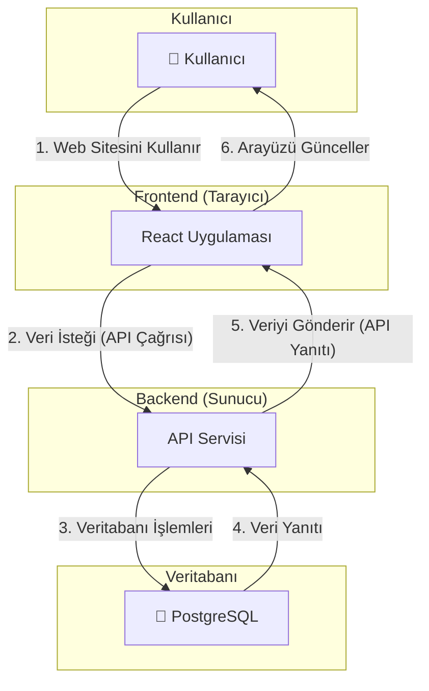
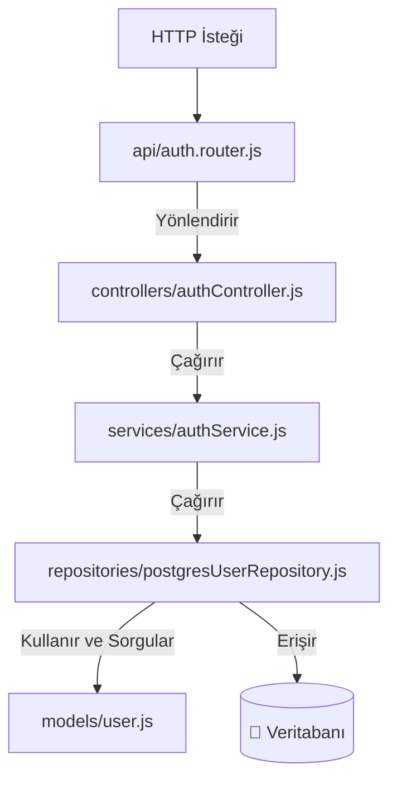
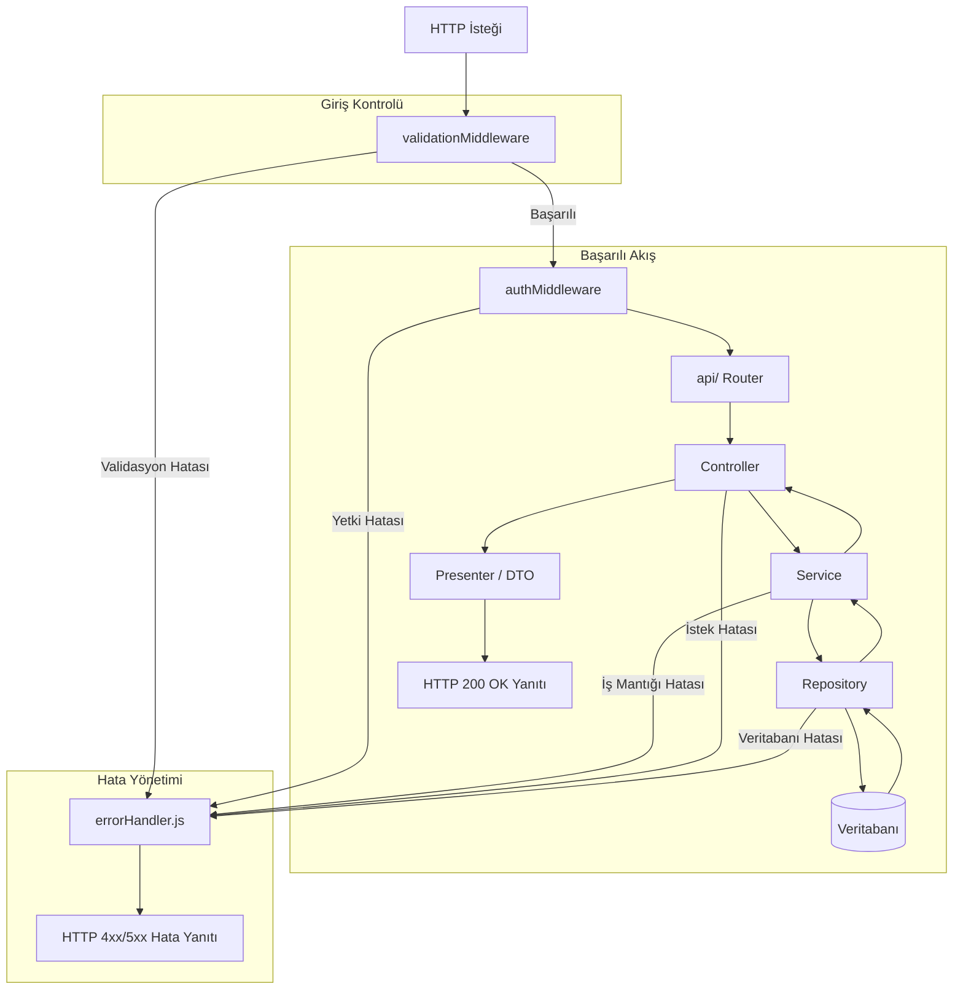

# Proje Mimarisi Raporu

**Tarih:** 23 Kasım 2025
**Konu:** Projenin Genel Teknik Yapısı ve Mimarisi Hakkında Bilgilendirme

---

## Yönetici Özeti

Bu rapor, mevcut projenin mimari temelini ve teknolojik altyapısını özetlemektedir. Proje, modern, güvenli ve ölçeklenebilir bir web uygulaması olarak tasarlanmıştır. Mimarisi, birbirinden bağımsız çalışan bir **Kullanıcı Arayüzü (Frontend)** ve bir **Sunucu Uygulamasından (Backend)** oluşmaktadır. Bu yapı, geliştirme süreçlerini hızlandırırken, sistemin uzun vadede sürdürülebilir ve güvenilir kalmasını sağlamaktadır.

---

## 1. Görselleştirilmiş Mimari Modeli (Genel Bakış)

Aşağıdaki şema, sistemin ana bileşenlerini ve aralarındaki etkileşim akışını göstermektedir.

---

## 2. Sunucu Mimarisi ve Akış Diyagramları

Uygulamanın beyni olarak kabul edilebilecek backend, tüm iş mantığını, veri yönetimini ve güvenliği sağlar. Aşağıdaki diyagramlar, backend'in iç yapısını ve işleyişini detaylandırmaktadır.

### 2.1. Backend Paket Akış Diyagramı

Bu diyagram, bir isteğin sunucu içindeki temel katmanlar arasında nasıl bir yol izlediğini özetler.

### 2.2. Detaylı Backend Akış Modeli (Middleware ve Hata Yönetimi ile)

Bu model, bir HTTP isteğinin backend içerisindeki tüm yaşam döngüsünü, ara katmanları ve **tüm hata durumlarını (veritabanı hataları dahil)** içerecek şekilde göstermektedir.

---

## Genel Değerlendirme

Proje, güncel teknolojilerle ve en iyi endüstri pratiklerine uygun olarak geliştirilmiştir. Sahip olduğu modüler ve düzenli mimari sayesinde gelecekteki yeni özelliklerin kolayca eklenmesine ve sistemin büyütülmesine olanak tanır. Bu yapı, projenin uzun vadede istikrarlı ve sürdürülebilir olmasını güvence altına almaktadır.
